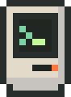
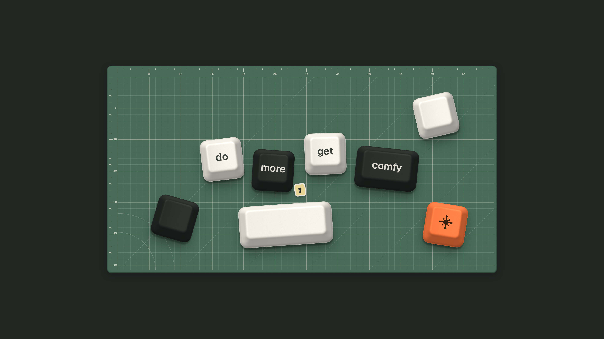

# Comfytosh Theme

> do more, get comfy

A cozy palette inspired by beige machines and old terminals.

**[vstrofago.github.io/comfytosh](https://vstrofago.github.io/comfytosh/)**: every port, the palette and the wallpapers.

Comfytosh Theme is a colour theme in the tradition of Catppuccin, Dracula and Nord: a named palette, two flavors and ready-made ports for the editors, terminals and tools you spend your day in. Warm-tinted neutrals, low-saturation accents and nothing pure black or pure white, so the screen rests the eye and the colour does the work.

## Flavors

| Flavor | Mood | Ground | Text |
|---|---|---|---|
| **Screen** (dark) | Inside the monitor | `crt-gunmetal` `#282e2b` | `crt-mint` `#d6e8c8` |
| **Case** (light) | In front of the machine | `case-bone` `#e3dac9` | `crt-gunmetal` `#282e2b` |

Screen is the glass of the monitor; Case is the beige plastic around it. Every text colour clears 4.5:1 on its flavor's ground, with a few documented exceptions in the ANSI whites and blacks. The Case colours are the `deep-*` twins of the Screen ones: same hue, darker.

## Palette

### Case plastics

| Name | Hex |
|---|---|
| `case-linen` | `#ece7de` |
| `case-bone` | `#e3dac9` |
| `case-silver` | `#c7c4bf` |
| `case-graphite` | `#333333` |

### Screen glass

| Name | Hex |
|---|---|
| `crt-carbon` | `#222623` |
| `crt-gunmetal` | `#282e2b` |
| `crt-charcoal` | `#343b37` |
| `crt-iron` | `#3c4641` |
| `crt-ebony` | `#555d50` |
| `crt-olive` | `#7e8f85` |
| `crt-ash` | `#bac1b8` |
| `crt-mint` | `#d6e8c8` |

### Phosphor greens

| Name | Hex |
|---|---|
| `phosphor-celadon` | `#7cd3a2` |
| `phosphor-soft` | `#a9dfbf` |
| `phosphor-aqua` | `#9bf5c5` |
| `phosphor-lime` | `#c5f899` |

### Amber

| Name | Hex |
|---|---|
| `amber-custard` | `#e8d595` |
| `amber-bronze` | `#e59f71` |
| `amber-taupe` | `#8a716a` |

### Signal

| Name | Hex |
|---|---|
| `signal-tangerine` | `#ff773d` |
| `signal-scarlet` | `#df2935` |
| `signal-grapefruit` | `#ff6b6b` |

### Comfy cool hues

| Name | Hex |
|---|---|
| `comfy-periwinkle` | `#8fb3dd` |
| `comfy-lilac` | `#b9a3d9` |
| `comfy-lagoon` | `#7fcfd4` |
| `comfy-rose` | `#e594b4` |

### Deep (text on Case)

| Name | Hex |
|---|---|
| `deep-tangerine` | `#ae3400` |
| `deep-scarlet` | `#ac1a23` |
| `deep-phosphor` | `#22643f` |
| `deep-bronze` | `#91491a` |
| `deep-ebony` | `#4b5247` |
| `deep-periwinkle` | `#2f5f93` |
| `deep-lilac` | `#6a4c97` |
| `deep-lagoon` | `#1d6368` |
| `deep-rose` | `#8f3558` |

The full palette and every role (syntax, terminal, diff, status) are in [`palette.json`](palette.json), resolved for both flavors.

## Ports

Each folder has a README with its install steps. The registry of every port is [`ports.json`](ports.json).

| Tool | Folder |
|---|---|
| VS Code (and Cursor, Windsurf, VSCodium) | [`vscode/`](vscode) |
| Zed | [`zed/`](zed) |
| Neovim | [`nvim/`](nvim) |
| Helix | [`helix/`](helix) |
| JetBrains IDEs | [`jetbrains/`](jetbrains) |
| Sublime Text | [`sublime/`](sublime) |
| Ghostty | [`ghostty/`](ghostty) |
| Alacritty | [`alacritty/`](alacritty) |
| Kitty | [`kitty/`](kitty) |
| WezTerm | [`wezterm/`](wezterm) |
| iTerm2 | [`iterm2/`](iterm2) |
| Windows Terminal | [`windows-terminal/`](windows-terminal) |
| Warp | [`warp/`](warp) |
| tmux | [`tmux/`](tmux) |
| Starship | [`starship/`](starship) |
| bat | [`bat/`](bat) |
| fzf | [`fzf/`](fzf) |
| lazygit | [`lazygit/`](lazygit) |
| btop | [`btop/`](btop) |
| Obsidian | [`obsidian/`](obsidian) |
| Omarchy | [`omarchy/`](omarchy) |

## Wallpapers

Four 4K PNGs in [`wallpapers/`](wallpapers), in the palette's greens and plastics.

| File | Size | What |
|---|---|---|
| `wallpaper-desktop-4k.png` | 3840×2160 | Keycaps on a cutting mat, over `crt-gunmetal` |
| `wallpaper-mobile-4k.png` | 2160×3840 | Keycaps on a cutting mat, over `crt-gunmetal` |
| `cutmat-desktop-4k.png` | 3840×2160 | Cutting mat, full bleed, no keys |
| `cutmat-mobile-4k.png` | 2160×3840 | Cutting mat, full bleed, no keys |



## Install

**VS Code.** Copy the `vscode/` folder to `~/.vscode/extensions/comfytosh.comfytosh-theme-0.1.0/` and restart, then run *Preferences: Color Theme*. The `publisher` in `package.json` is a placeholder.

**Zed.** Copy `zed/comfytosh.json` to `~/.config/zed/themes/`, then pick Comfytosh Screen or Comfytosh Case.

**Neovim.** Put `nvim/lua` and `nvim/colors` in your config, then:

```lua
require("comfytosh").setup({ transparent = false })
vim.cmd.colorscheme("comfytosh") -- follows vim.o.background
```

**Helix.** Copy `helix/themes/*.toml` to `~/.config/helix/themes/` and set `theme = "comfytosh-screen"`.

**Ghostty.** Copy `ghostty/*` to `~/.config/ghostty/themes/` and set `theme = light:comfytosh-case,dark:comfytosh-screen`.

**Alacritty.** Copy `alacritty/*.toml` to `~/.config/alacritty/themes/` and add it to `general.import`.

**Kitty.** Copy `kitty/*.conf` to `~/.config/kitty/themes/` and add `include themes/comfytosh-screen.conf` to `kitty.conf`.

**WezTerm.** Copy `wezterm/colors/` next to `wezterm.lua`, then set `config.color_scheme_dirs` and `config.color_scheme = 'Comfytosh Screen'`.

**iTerm2.** Settings, Profiles, Colors, Color Presets, Import.

**Windows Terminal.** Paste the two objects from `windows-terminal/comfytosh.json` into `schemes` in `settings.json`.

**Omarchy.** Copy `omarchy/comfytosh-screen` and `omarchy/comfytosh-case` to `~/.config/omarchy/themes/`, then `omarchy-theme-set comfytosh-screen`. Each Omarchy theme can also be published as its own repository, named `omarchy-comfytosh-screen-theme`.

The other ports (JetBrains, Sublime Text, Warp, tmux, Starship, bat, fzf, lazygit, btop, Obsidian) are single files: copy them to the usual place for that tool.

## Contributing

Comfytosh is open the way Catppuccin and Dracula are: anyone can bring it to the tool they love. Missing a tool? [Request a port](https://github.com/vstrofago/comfytosh/issues/new?template=port-request.yml), or build it with [the contributing guide](CONTRIBUTING.md): copy [`template/`](template), map the app to the roles in `palette.json`, ship both flavors and register it in `ports.json`. `python3 scripts/check_ports.py` runs the same checks as CI.

The website is built from `palette.json` and `ports.json` by `scripts/build_site.py` and deploys to GitHub Pages on every push to `main`. It uses the Comfytosh design system, vendored in [`site/vendor/comfytosh/`](site/vendor/comfytosh).

## Origin

Comfytosh began as a personal palette paying homage to the classic Macintosh and green-phosphor terminals. This is the universal, colour-only version.

## License

[MIT](LICENSE). The fonts the website uses, in `site/vendor/comfytosh/fonts/`, are under the SIL Open Font License 1.1 (see `OFL.txt` there).
